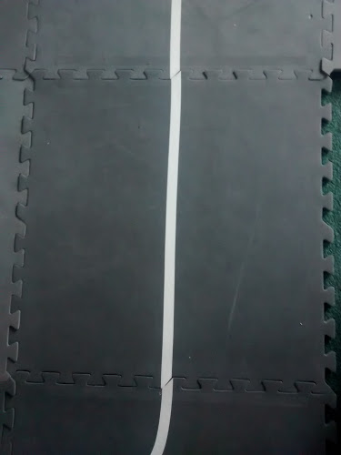
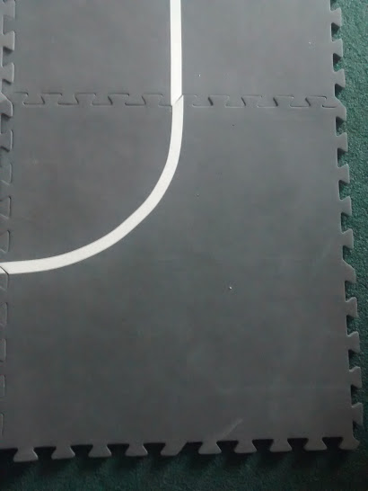
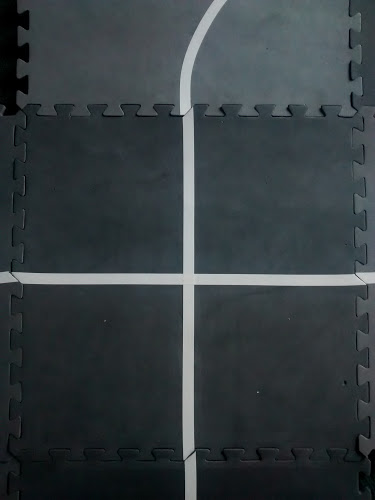
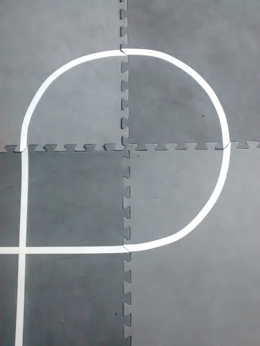
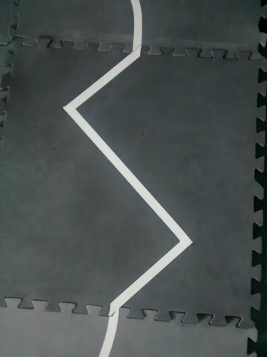

sparkiline
==========

Line following with the Sparki robot.

Recommended lines: 3/4 inch white electrical tape on gray "Anti-Fatigue
Foam Mat" (2 foot squares) as can be found at Harbor Freight. Turn
the mats upside down (i.e. smooth side up) and put the various tape
patterns on the squares. The squares can then be assembled into various
track patterns.

## Tile Tracks

### Straight Line

The straight section gives Sparki an easy pattern to follow. It also
can be used to see how well the program can capture a line by starting
Sparki completely off the line, but pointing at the line at a shallow
angle. As the near sensor goes over the line, Sparki will turn into the
line. Ideally, the program will cross the line and capture it. A figure
of merit for the program will then be how large of an angle can Sparki
be to the line and still reliably capture the line.

### Curves

The curved sections can be put together as a circle, which is very useful
for testing the integral term of a PID loop. It can be combined with
the straight sections to form an oval track. Substituting a zig-zag
section for a stright section in the oval forms a tracking torture test.

Six curved sections can be combined with the crossover section to form
a figure eight. A figure eight track is useful for verifying Sparki
can follow both a left-hand and right-hand curve as well as traverse
the crossover.

### Crossover

The crossover is used with curved tiles to form a figure eight track.

### Loop

Example of a loop end section.

# Zig-Zag

The zig-zag section can replace a straight section. This is a very
difficult pattern to follow with just a PID loop.
